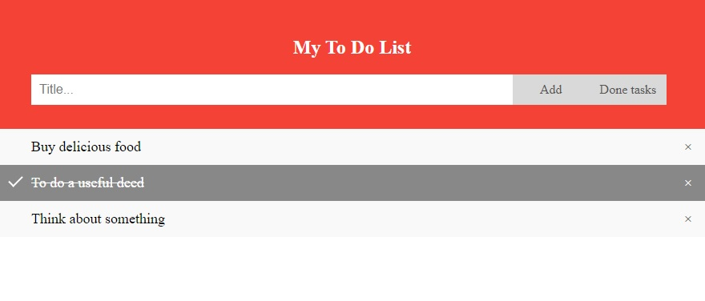

# job4j_to-do_list

Техническое задание: Простое приложение To-Do List

Краткое описание проекта:
- Проект представлен одной веб-страницей
- Возможно добавлять, удалять, помечать выполненные задачи
- Выполненные задачи можно скрывать и снова показывать  
- Запросы на сервер отправлялись с помощью Fetch API. Без перезагрузки всей страницы
- Данные хранятся в базе данных PostgreSQL
- Структура базы данных в виде таблицы: ITEMS
 
 

В данном проекте использовались:
- Servlet
- HTML, CSS, JavaScript, асинхронные запросы с помощью Fetch API
- PostgreSQL, Hibernate - все данные хранились в БД. По мере необходимости извлекались и использовались
- JSON - Использовался для обмена данными
- SLF4J, Logback - Ведение логов в проекте
- Mockito, PowerMock - тестирование
- Checkstyle, Jacoco
 
 

Начальная страница. Добавленные задачи можно отмечать выполненными (зачеркиваются). Удалять задачи (крестик с права):

  
Возможно скрыть выполненные задачи кнопкой "Done tasks":
